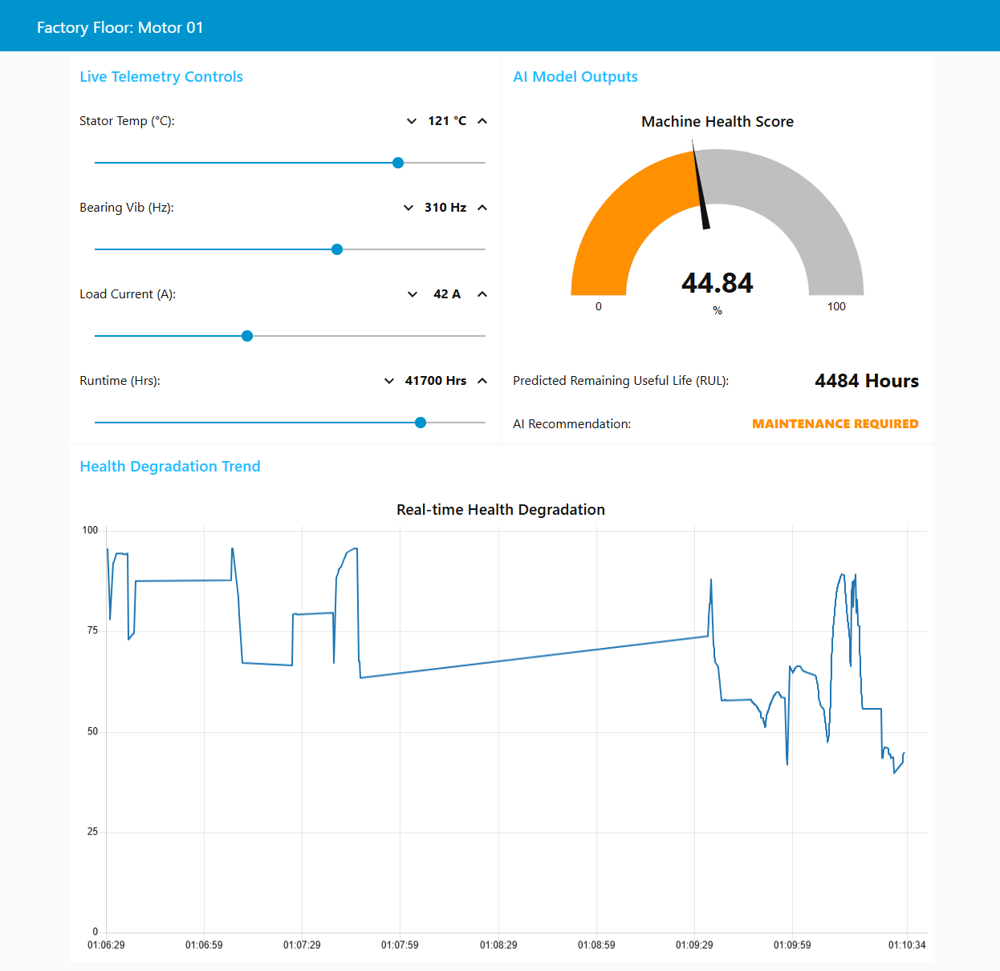
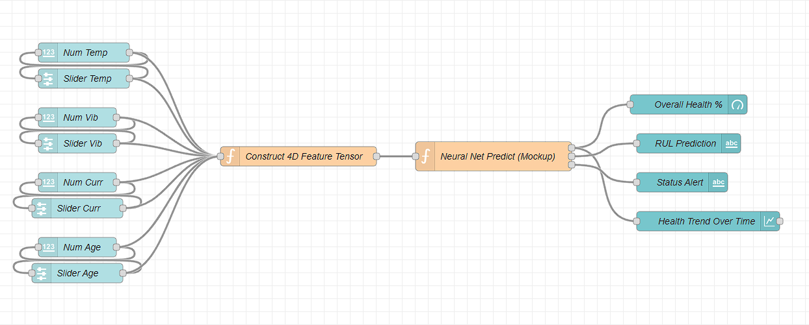

# Diagnostic Moteur - Tableau de Bord Industriel

Tableau de bord de supervision et de diagnostic prédictif de moteur en temps réel, construit avec Node-RED.

Ce projet simule et visualise la télémétrie en direct d'un moteur industriel, en intégrant un modèle prédictif pour estimer l'état de santé et la durée de vie résiduelle (RUL - Remaining Useful Life) :

- Simulation de la température du stator, des vibrations des roulements, du courant de charge et du temps de fonctionnement
- Calcul en temps réel d'un score global de santé de la machine
- Prédiction de la durée de vie utile restante (RUL) 
- Alertes de statut (Optimal, Maintenance requise, Panne critique imminente)
- Visualisation graphique de la dégradation de la santé dans le temps

## Capture Du Tableau De Bord

## Architecture Du Flow

Flow Node-RED complet :

## Démarrage Rapide

1. Installer Node-RED ainsi à que les dépendances Node-RED Dashboard.
2. Importer `flows.json` dans votre éditeur Node-RED.
3. Déployer le flow.
4. Ouvrir le tableau de bord depuis l'endpoint UI de Node-RED.

## Contributeurs

- Oumaima Dribi Alaoui
- Rabyâ Raghib
- Kawtar Sahili
