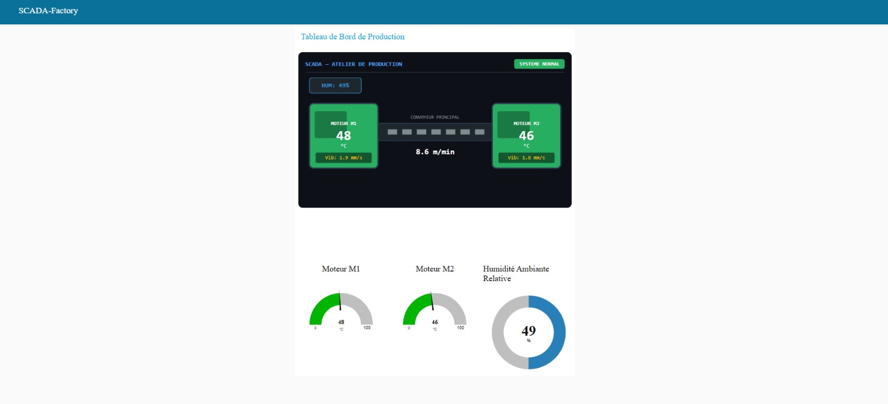
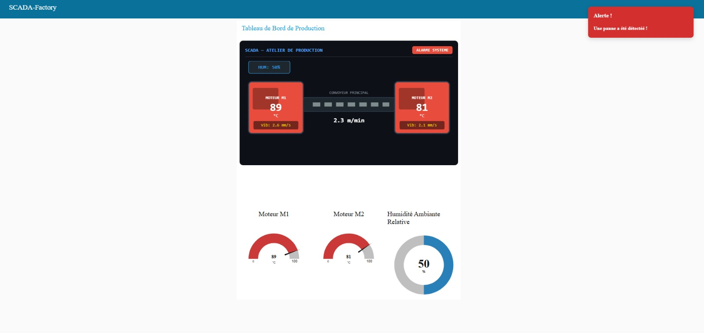
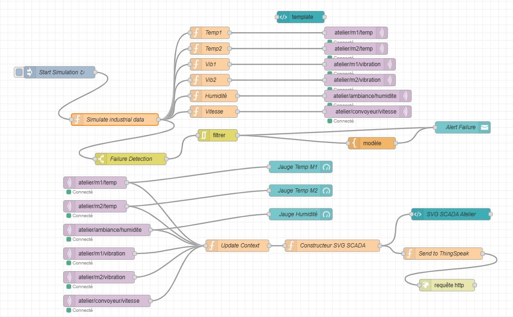
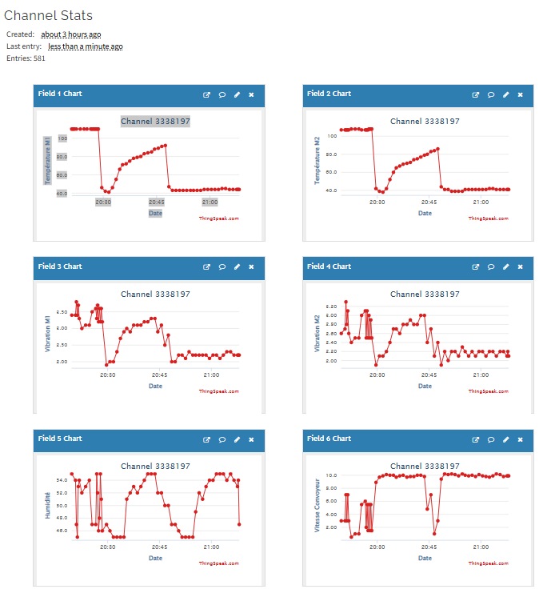

# SCADA Factory - Tableau de Bord Industriel

Tableau de bord SCADA en temps réel construit avec Node-RED pour simuler et superviser un atelier de production.

Ce projet permet de générer, visualiser et historiser des données industrielles autour de deux moteurs et d'un convoyeur, avec détection de panne et intégration ThingSpeak.

## Fonctionnalités Principales

- Simulation continue des températures moteurs (M1, M2)
- Simulation des vibrations moteurs et de l'humidité ambiante
- Suivi de la vitesse du convoyeur avec adaptation en cas de panne
- Détection automatique de pannes selon des seuils critiques
- Affichage du dashboard en mode normal et mode alerte
- Publication des mesures vers ThingSpeak pour l'historisation distante

## Aperçu Du Tableau De Bord

État normal :

État d'alerte :

## Architecture Du Flow

Flow Node-RED complet :

## Visualisation ThingSpeak

Suivi des mesures historisées sur le canal ThingSpeak :

## Démarrage Rapide

1. Installer Node-RED ainsi que Node-RED Dashboard.
2. Importer `flows.json` dans l'éditeur Node-RED.
3. Configurer les nœuds nécessaires (inject, dashboard, MQTT/alertes si besoin).
4. Renseigner les informations ThingSpeak (Write API Key et Channel).
5. Déployer le flow puis ouvrir le dashboard pour suivre la supervision en direct.

## Contributeurs

- Oumaima Dribi Alaoui
- Rabyâ Raghib
- Kawtar Sahili
