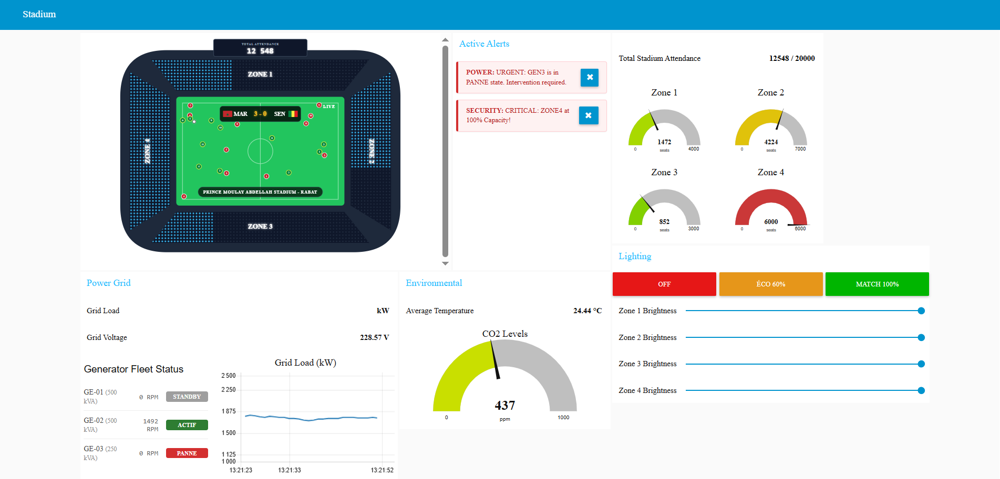
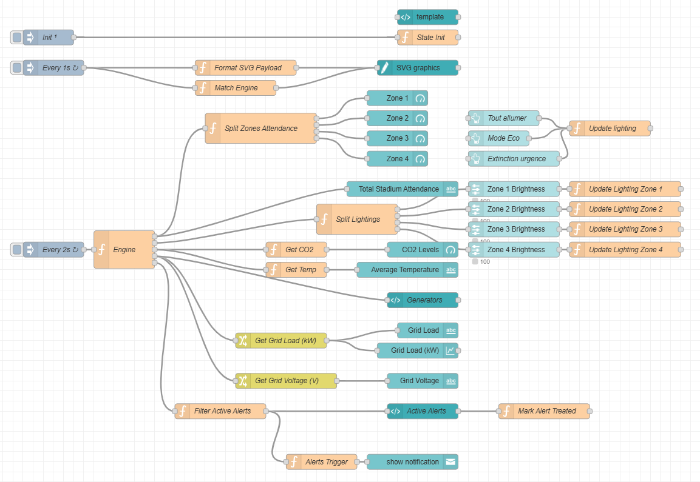

# Tableau De Bord Des Opérations Du Stade

Tableau de bord de supervision et de contrôle du stade en temps réel, construit avec Node-RED.

Ce projet simule et visualise les opérations clés du stade dans une interface unique :
- Affluence par zone avec suivi des capacités
- Contrôle de l'éclairage par zone (avec modes globaux rapides)
- Mesures environnementales (CO2 et température)
- Supervision énergétique (charge réseau, tension et état des générateurs)
- Workflow d'alertes avec traitement et acquittement
- Visualisation SVG interactive du stade avec mise à jour en direct de l'affluence et de l'opacité de l'éclairage

## Capture Du Tableau De Bord

## Architecture Du Flow

Flow Node-RED complet :

## Démarrage Rapide

1. Installer Node-RED ainsi que les dépendances Node-RED Dashboard.
2. Importer `flows.json` dans votre éditeur Node-RED.
3. Déployer le flow.
4. Ouvrir le tableau de bord depuis l'endpoint UI de Node-RED.

## Contributeurs

- Oumaima Dribi Alaoui
- Rabyâ Raghib
- Kawtar Sahili

